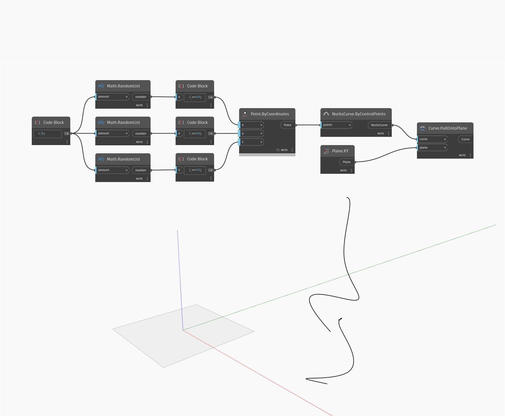

## Podrobnosti
Uzel Pull Onto Plane vytvoří novou křivku promítnutím vstupní křivky na vstupní rovinu, přičemž jako směr promítnutí se použije normála roviny. V níže uvedeném příkladu nejprve vytvoříme křivku Nurbs pomocí uzlu ByControlPoints, přičemž jako vstup se použije sada náhodně generovaných bodů. Jako rovinu, na kterou se bude promítat v uzlu PullOntoPlane, použijeme globální rovinu XY. Výsledkem je rovinná křivka na rovině XY.
___
## Vzorový soubor

