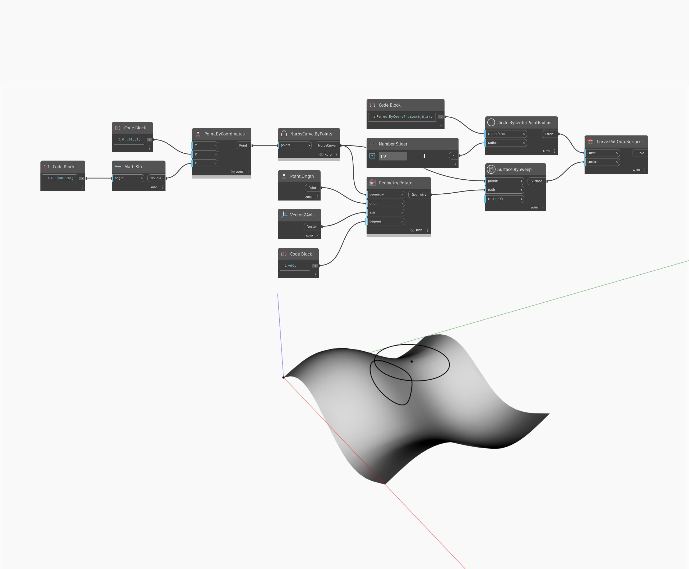

## Podrobnosti
Uzel Pull Onto Surface vytvoří novou křivku promítnutím vstupní křivky na vstupní povrch, přičemž jako směry promítnutí se použijí normálové vektory povrchu. V níže uvedeném příkladu nejprve vytvoříme povrch pomocí uzlu Surface.BySweep, který používá křivky generované podle sinusoidy. Tento povrch se použije jako základní povrch pro roztažení v uzlu PullOntoSurface. Pro křivku vytvoříme kružnici pomocí bloku kódu, který určuje souřadnice středu, a číselného posuvníku, který řídí poloměr kružnice. Výsledkem je promítnutí kružnice na povrch.
___
## Vzorový soubor

