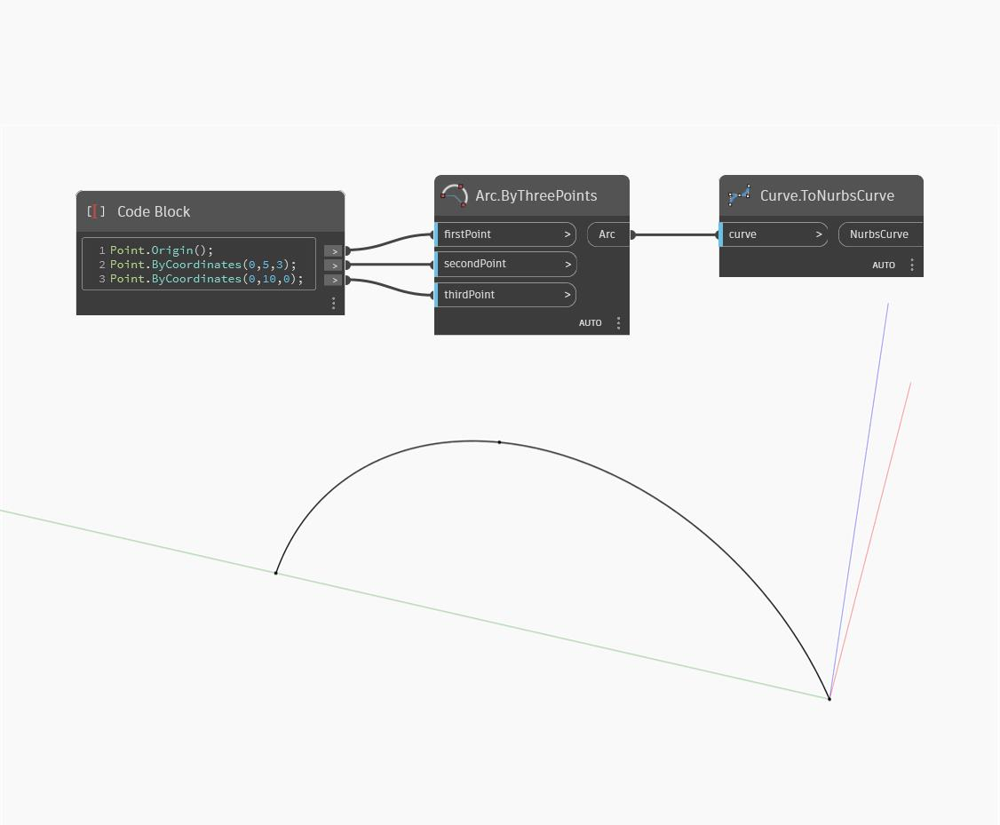

## Podrobnosti
Uzel To Nurbs Curve přijímá jako vstup křivku a vrací křivku Nurbs, která aproximuje vstupní křivku. V níže uvedeném příkladu vytvoříme oblouk pomocí bloku kódu, který definuje tři body, a pomocí uzlu Arc.ByThreePoints. Tento oblouk je převeden na křivku Nurbs pomocí uzlu ToNurbsCurve. Všimněte si, že výchozí stupeň výsledné křivky Nurbs je 3.
___
## Vzorový soubor

