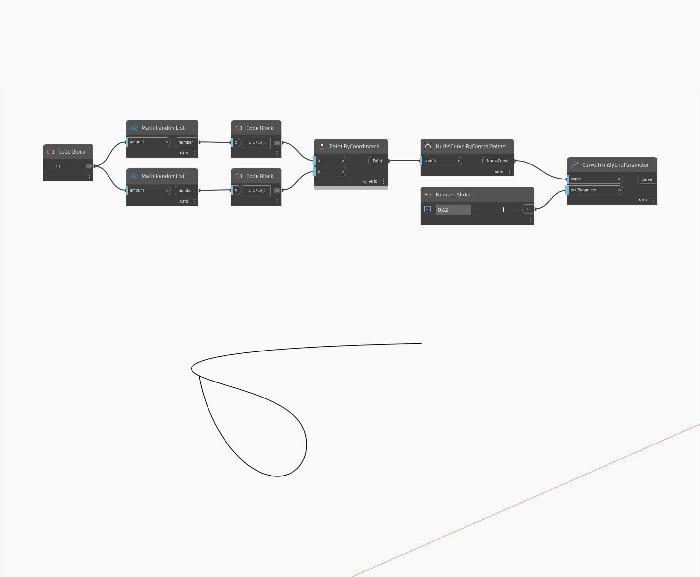

## Podrobnosti
Uzel Trim By End Parameter odebere konec vstupní křivky oříznutím v určeném parametru. V níže uvedeném příkladu nejprve vytvoříme křivku Nurbs pomocí uzlu ByControlPoints, přičemž jako vstup se použije sada náhodně generovaných bodů. K řízení vstupu parametru pro uzel TrimByEndParameter se použije číselný posuvník nastavený na rozsah 0 až 1.
___
## Vzorový soubor

