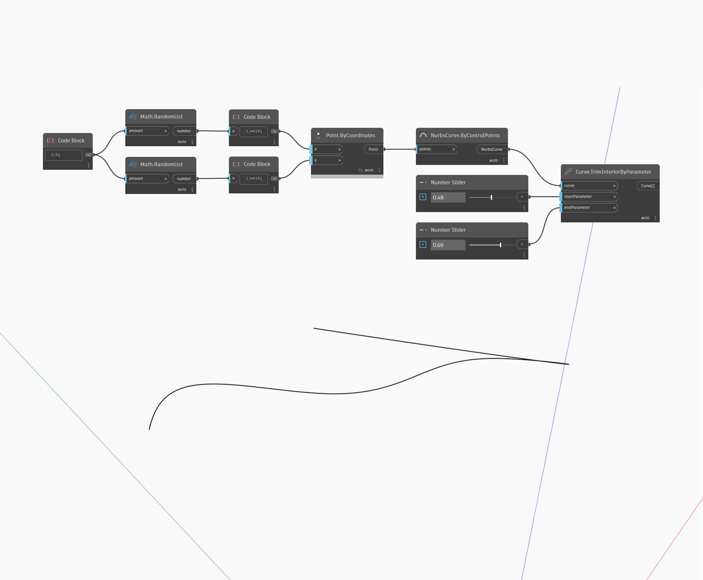

## Podrobnosti
Uzel Trim Interior By Parameter odebere vnitřní část dané křivky podle dvou vstupních parametrů. Tento uzel vytvoří dvě zbývající vnější části křivky jako seznam dvou křivek. V níže uvedeném příkladu vygenerujeme seznam bodů pomocí dvou sad náhodných čísel. Pomocí těchto bodů se vytvoří křivky Nurbs podle řídicích bodů. Vstupy parametrů pro uzel TrimInteriorByParameter jsou určeny pomocí dvou číselných posuvníků nastavených na rozsah od nuly do jedné.
___
## Vzorový soubor

