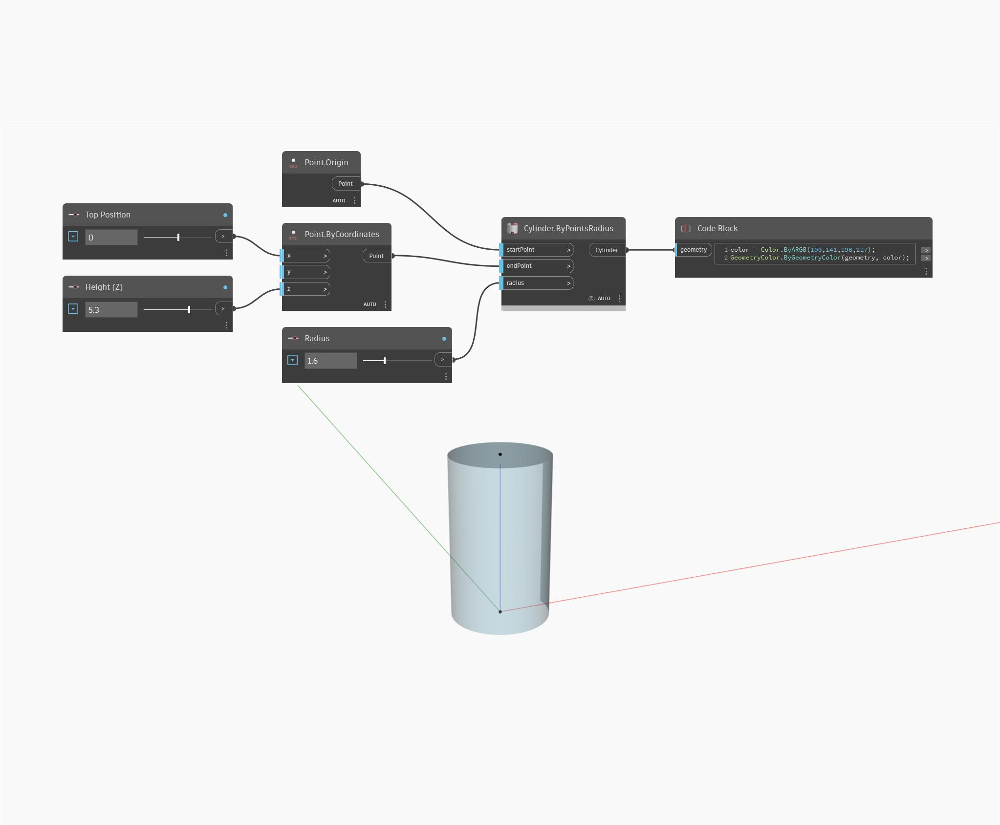

## Podrobnosti
Metoda ByPointsRadius vrátí válec z počátečního bodu, koncového bodu a hodnoty poloměru. V níže uvedeném příkladu se při úpravě číselných posuvníků změní pozice bodů i poloměr válce.
___
## Vzorový soubor

