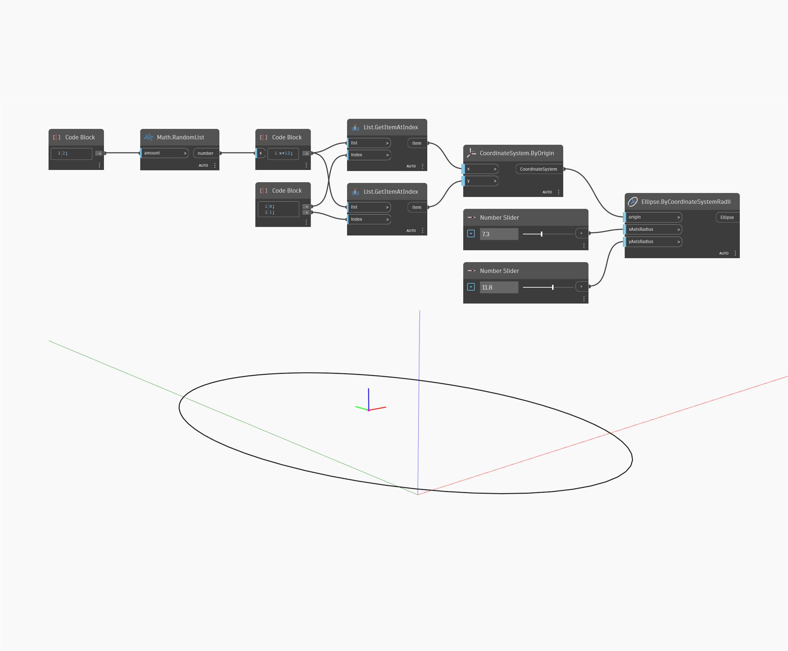

## Podrobnosti
Uzel Ellipse by Coordinate System Radii přijímá jako vstup souřadnicový systém a poté vytvoří elipsu pomocí zadaných poloměrů. Vstupní hodnoty xAxisRadius a yAxisRadius odpovídají směrům X a Y vstupního souřadnicového systému (nikoli globálním směrům X a Y). V níže uvedeném příkladu vygenerujeme dvě náhodné hodnoty k vytvoření souřadnicového systému a poté tento souřadnicový systém použijeme společně se dvěma číselnými posuvníky pro poloměry x a y.
___
## Vzorový soubor

