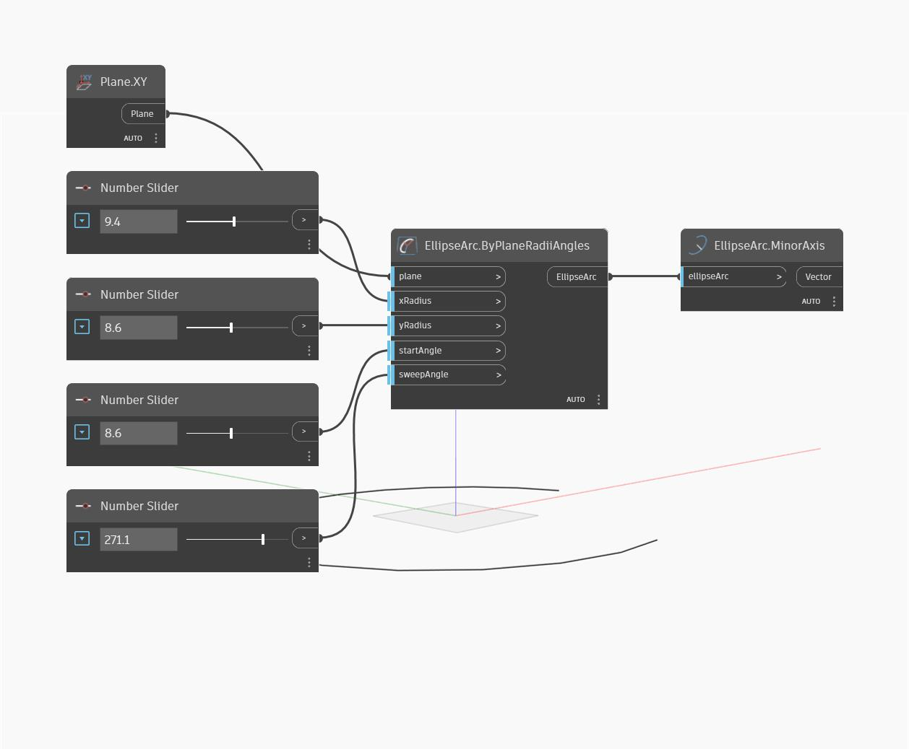

## Podrobnosti
Uzel Minor Axis vrátí kratší ze dvou os elipsy. Osa je vrácena jako vektor, který má velikost rovnou menšímu ze dvou poloměrů. Všimněte si, že hlavní a vedlejší osa je určena délkou, nikoli směrem. To znamená, že vedlejší osa může odpovídat hodnotě xAxisRadius jedné elipsy, ale také hodnotě yAxisRadius jiné elipsy. V příkladu nejprve vytvoříme oblouk elipsy pomocí roviny XY a řady číselných posuvníků. Poté pomocí uzlu Minor Axis extrahujeme vedlejší osu elipsy.
___
## Vzorový soubor

