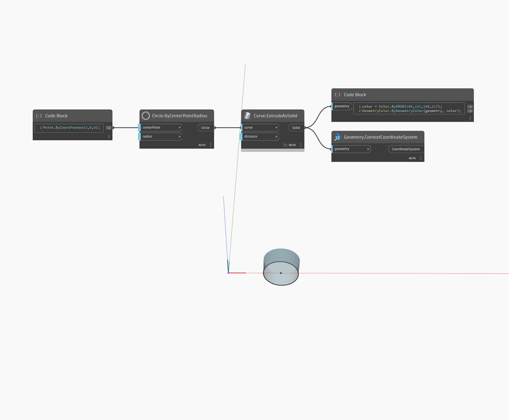

## Podrobnosti
Uzel ContextCoordinatesSystem vrátí objekt CoordinateSystem, který byl použit při tvorbě části geometrie. V níže uvedeném příkladu těleso vytvořené na umístění objektu centerPoint (3,0,0) vrátí objekt CoordinateSystem umístěný v počátku.
___
## Vzorový soubor

