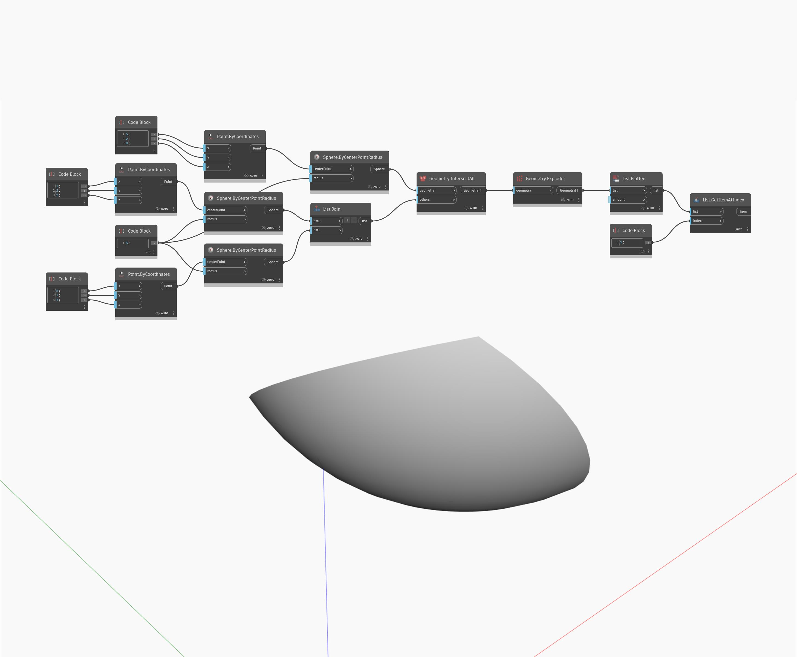

## Podrobnosti
Uzel Geometry Explode rozdělí geometrii na menší komponenty. Například objekt Polysurface je možné rozložit na několik povrchů a objekt Polycurve na křivky. V tomto příkladu extrahujeme jeden povrch ze složitého průsečíku tří koulí.
___
## Vzorový soubor

