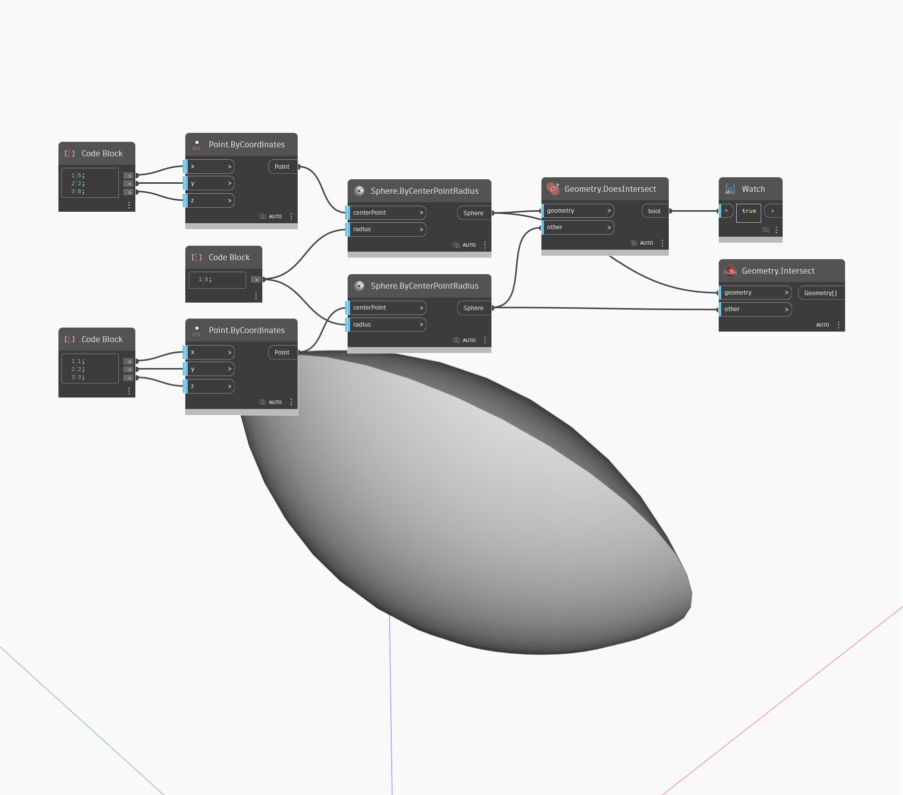

## Podrobnosti
Uzel Geometry Intersect najde geometrii průsečíku sdílenou dvěma objekty geometrie. V tomto příkladu průsečík dvou koulí vrací objekt Polysurface, jinak označovaný jako průsečík těles.
___
## Vzorový soubor

