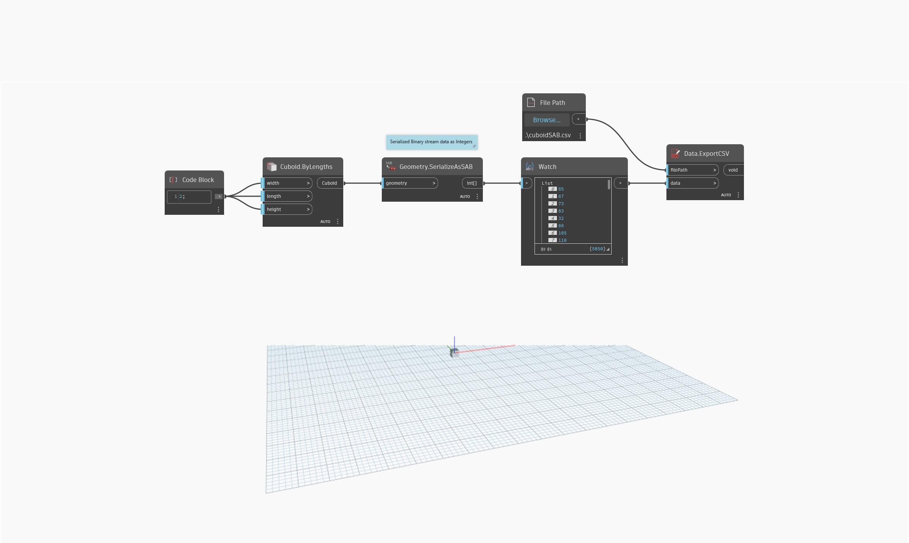

## Podrobnosti
Uzel `Geometry.SerializeAsSAB` převede určenou geometrii do formátu SAB (Standard ACIS Binary) a vrátí data serializovaného binárního toku.

V následujícím příkladu je kvádr převeden do formátu SAB.

___
## Vzorový soubor

