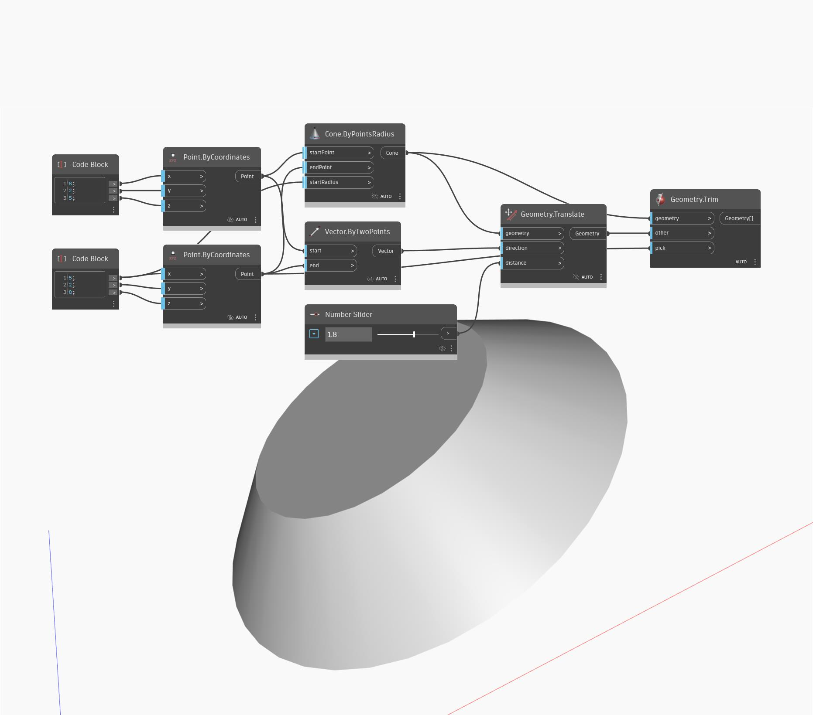

## Podrobnosti
Uzel Geometry Trim funguje podobně jako uzel Geometry Split v tom, že jako vstup přijímá nástroj – libovolný typ geometrie, pomocí kterého oříznete jinou geometrii – a geometrii, ale vrátí pouze jeden fragment geometrie. Geometrie je vybrána podle referenčního bodu nejblíže k fragmentu. V tomto příkladu je jeden kužel oříznut jiným kuželem a vybranou geometrií je jeho dolní část.
___
## Vzorový soubor

