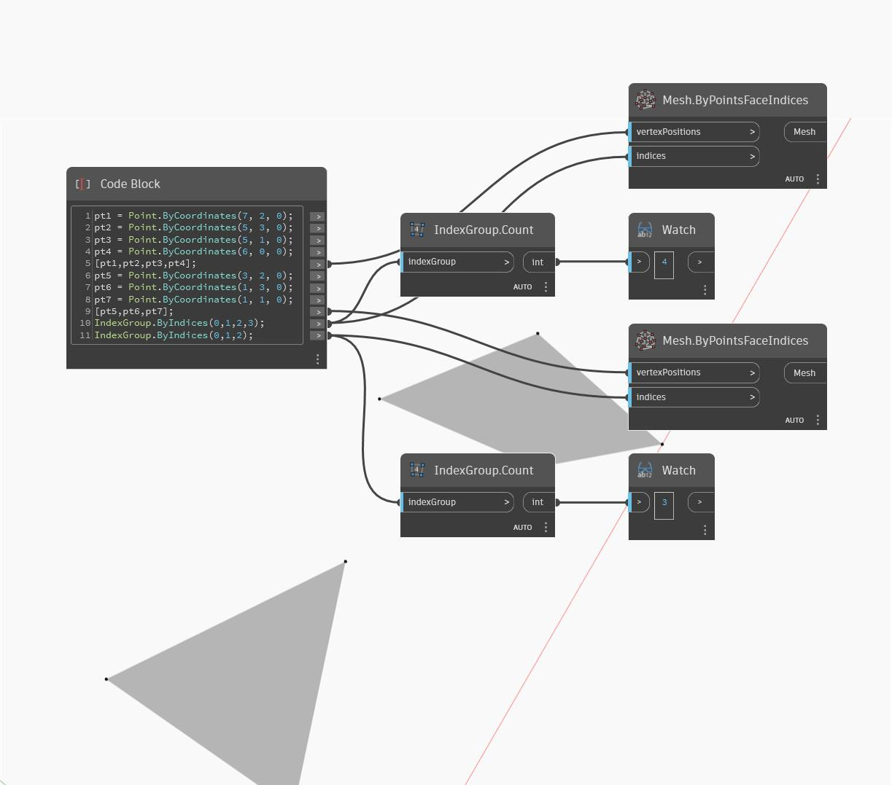

## Podrobnosti
Uzel Count vrátí celé číslo, které představuje počet indexů v objektu IndexGroup. V níže uvedeném příkladu jsou vráceny počty indexů ploch sítě se třemi a čtyřmi hranami.
___
## Vzorový soubor

