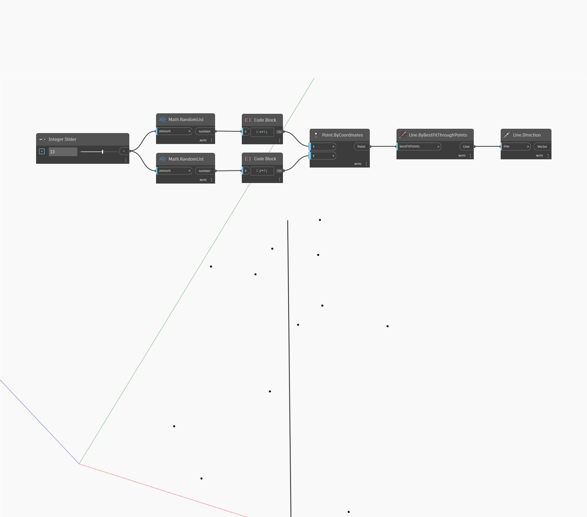

## Podrobnosti
Uzel Direction vrátí vektor, který ukazuje stejným směrem jako úsečka. Velikost vektoru je rovna délce původní úsečky. V níže uvedeném příkladu vygenerujeme sadu náhodných bodů a poté pomocí uzlu ByBestFitThroughPoints vytvoříme úsečku. Pomocí uzlu Direction je možné najít směr vektoru vytvořené úsečky.
___
## Vzorový soubor

