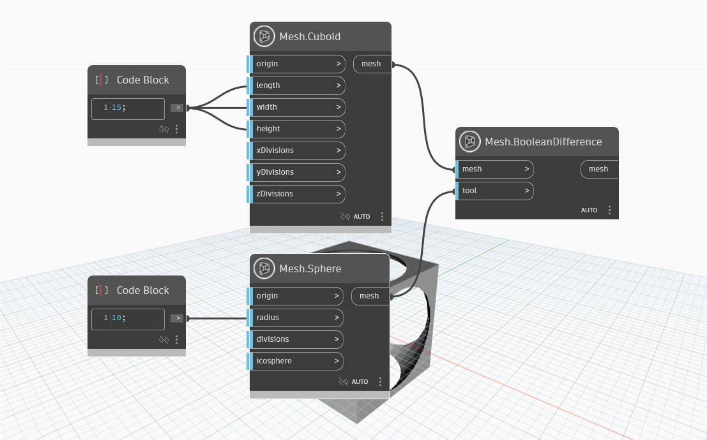

## Podrobnosti
Uzel `Mesh.BooleanDifference` přijímá jako vstup cílovou síť a síť nástroje. Tento uzel vypočítá booleovský rozdíl vyloučením jakéhokoli překrytí mezi sítí nástroje a cílovou sítí z cílové sítě.
V následujícím příkladu se pomocí uzlu `Mesh.BooleanDifference` odečte uzel `Mesh.Sphere` od uzlu `Mesh.Cuboid`.

## Vzorový soubor

