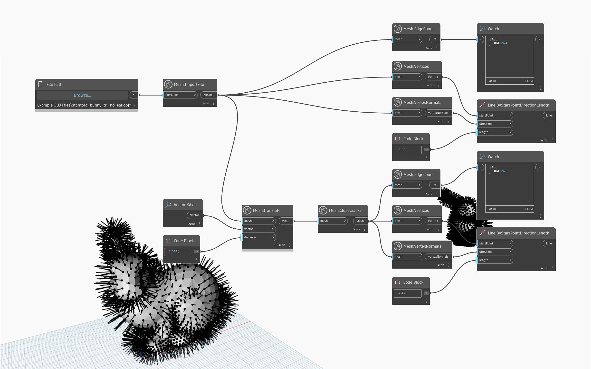

## Podrobnosti
Uzel `Mesh.CloseCracks` uzavře trhliny v síti odebráním vnitřních hranic z objektu sítě. Vnitřní hranice mohou vzniknout přirozeně jako výsledek operací modelování sítě. Trojúhelníky lze v této operaci odstranit, pokud jsou odebrány poškozené hrany. V níže uvedeném příkladu se na importovanou síť použije metoda `Mesh.CloseCracks`. K vizualizaci překrývajících se vrcholů se používá uzel `Mesh.VertexNormals`. Po průchodu původní sítě uzlem Mesh.CloseCracks se sníží počet hran, což je také zřejmé porovnáním počtu hran pomocí uzlu `Mesh.EdgeCount`.

## Vzorový soubor

