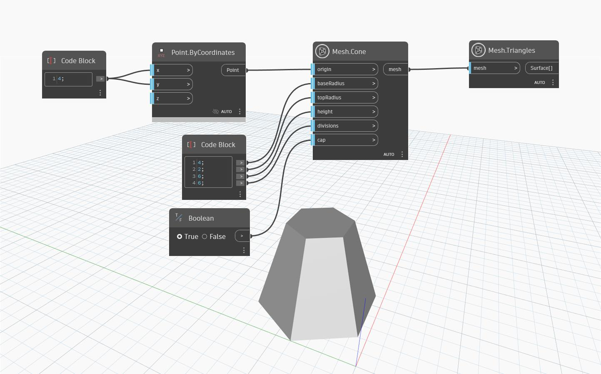

## Podrobnosti
Uzel `Mesh.Cone` vytvoří síťový kužel, jehož základna je vystředěna ve vstupním bodu počátku, pomocí vstupních hodnot pro poloměr základny a horní poloměr, výšku a počet dělení ve vstupu `divisions`. Počet dělení ve vstupu `divisions` odpovídá počtu vrcholů, které jsou vytvořeny na horní a dolní straně kužele. Pokud je počet dělení ve vstupu `divisions` 0, aplikace Dynamo použije výchozí hodnotu. Počet dělení podél osy Z je vždy roven 5. Vstup `cap` používá hodnotu `Boolean` k určení, zda je kužel v horní části uzavřený.
V níže uvedeném příkladu se pomocí uzlu `Mesh.Cone` vytvoří síť ve tvaru kužele se 6 děleními, takže základna a horní část kužele jsou šestiúhelníky. Uzel `Mesh.Triangles` slouží k vizualizaci rozložení trojúhelníků sítě.

## Vzorový soubor

