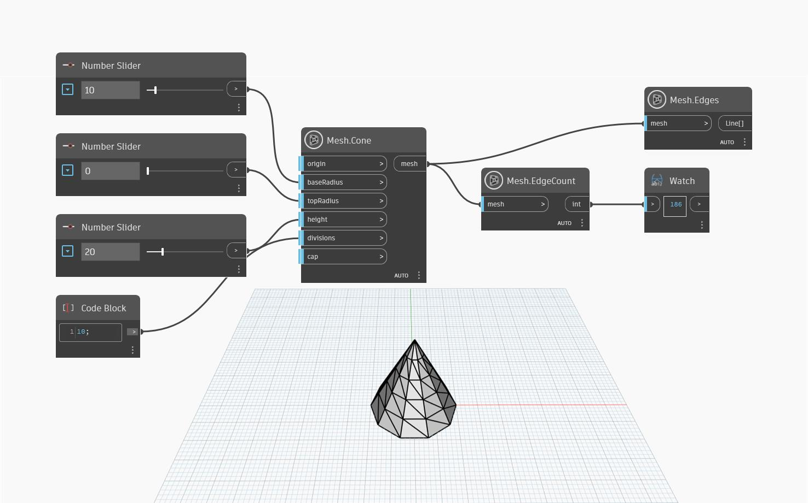

## Podrobnosti
Tento uzel spočítá počet hran v zadané síti. Pokud je síť tvořena trojúhelníky, což je případ všech sítí uzlu `MeshToolkit`, uzel `Mesh.EdgeCount` vrátí pouze jedinečné hrany. V důsledku toho je třeba očekávat, že počet hran nebude trojnásobný než počet trojúhelníků v síti. Tento předpoklad lze použít k ověření, zda síť neobsahuje nesvařené plochy (může se vyskytnout v importovaných sítích).

V následujícím příkladu se pomocí uzlů `Mesh.Cone` a `Number.Slider` vytvoří kužel, který se pak použije jako vstup pro počítání hran. K zobrazení náhledu struktury a osnovy sítě lze použít jak uzel `Mesh.Edges`, tak uzel `Mesh.Triangles`, přičemž uzel `Mesh.Edges` vykazuje lepší výkon u složitých a těžkých sítí.

## Vzorový soubor

