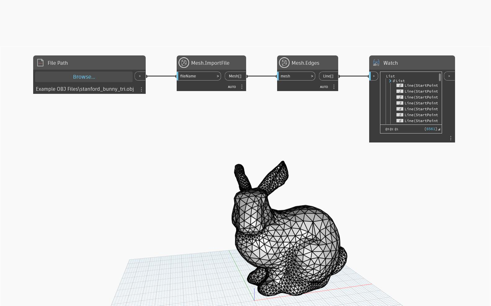

## Podrobnosti
Metoda `Mesh.Edges` vrací základní hrany sítě jako čáry aplikace Dynamo. Tento uzel je užitečný pro vizualizaci struktury sítě, dotazování se na její konstrukci a také krok při převodu sítě nebo úpravě jejího tvaru. V následujícím příkladu se u importované sítě použije uzel `Mesh.Edges`, který poskytuje užitečné informace o rozlišení sítě.

## Vzorový soubor

