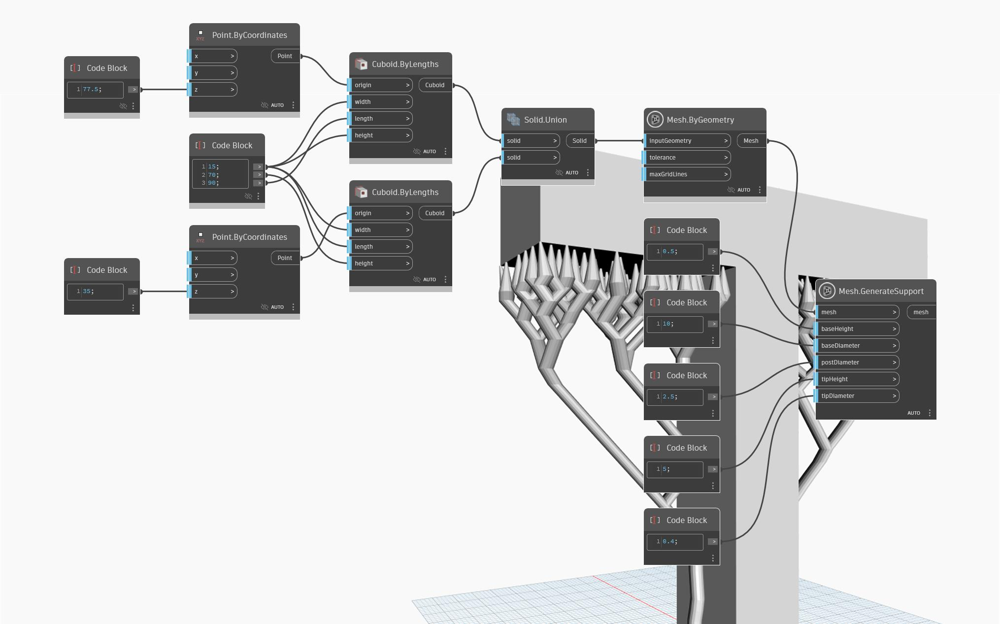

## Podrobnosti
Uzel `Mesh.GenerateSupport` slouží k přidání podpor ke vstupní geometrii sítě za účelem její přípravy na 3D tisk. K úspěšnému tisku geometrie s přesahy jsou vyžadovány podpěry, aby se zajistila správná přilnavost vrstev a zabránilo se prohýbání materiálu během procesu tisku. Uzel `Mesh.GenerateSupport` detekuje přesahy a automaticky generuje podpory stromového typu, které spotřebovávají méně materiálu a lze je snadněji odstranit, protože mají menší kontakt s tisknutým povrchem. V případech, kdy nejsou detekovány žádné přesahy, je výsledkem uzlu `Mesh.GenerateSupport` stejná síť, otočená do optimální orientace pro tisk a přesunutá do roviny XY. Konfigurace podpor je řízena vstupy:
- baseHeight – definuje tloušťku nejnižší části podpěry – její základny
- baseDiameter určuje velikost základny podpěry
- vstup postDiameter určuje velikost každé podpory uprostřed
- tipHeight a tipDiameter určují velikost podpěr na jejich špičce, v kontaktu s tištěným povrchem
V následujícím příkladu se pomocí uzlu `Mesh.GenerateSupport` přidají podpory do sítě ve tvaru písmene ‘T’.

## Vzorový soubor

