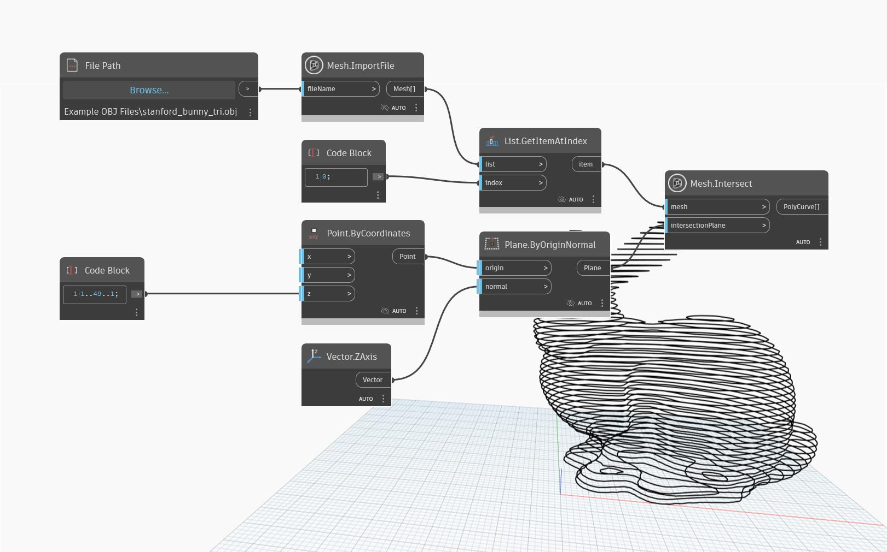

## Podrobnosti
Uzel `Mesh.Intersect` protíná síť se vstupní rovinou a vrací jeden nebo více objektů PolyCurve.

V následujícím příkladu se `Mesh.Intersect` použije na síť ve tvaru králíčka. Síť se protíná s řadou vstupních rovin a vytváří řezy jako obrysy. Jedná se o výchozí bod pro přípravu modelu k výrobě laserovým nástrojem, vodním paprskem nebo CNC frézou.

## Vzorový soubor

