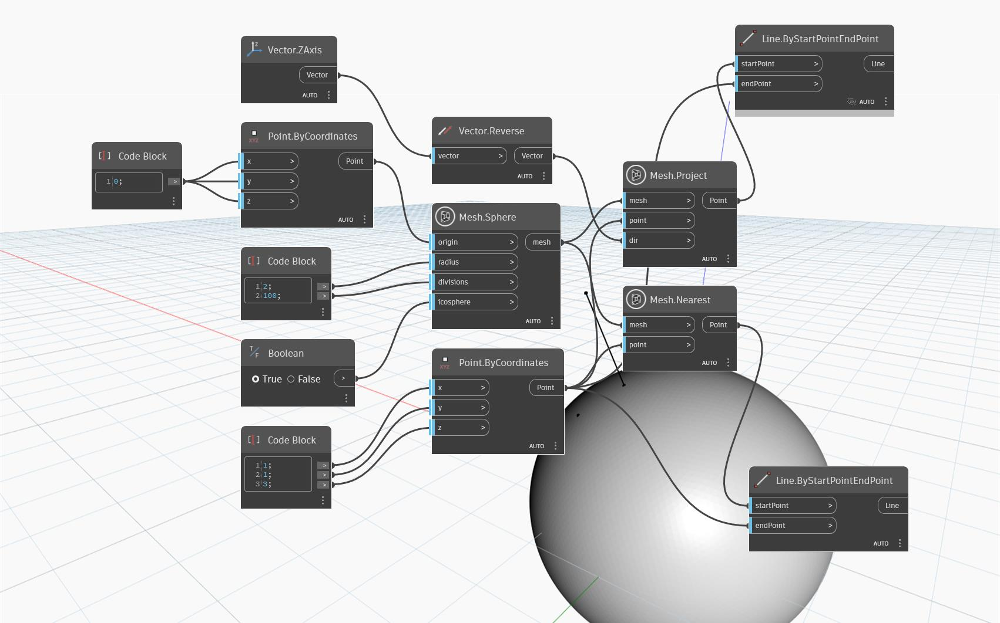

## Podrobnosti
Uzel `Mesh.Nearest` vrací bod na vstupní síti, který je nejblíže k danému bodu. Vrácený bod je projekcí vstupního bodu na síť, která vznikne použitím normálového vektoru sítě procházející přes bod, přičemž vznikne nejbližší možný bod.

V následujícím příkladu je vytvořen jednoduchý případ použití, který ukazuje, jak uzel funguje. Vstupní bod je nad kulovou sítí, ale ne přímo na jejím vrcholu. Výsledný bod je nejbližší bod, ve kterém leží síť. To se liší od výstupu uzlu `Mesh.Project` (na vstupech se použije stejný bod a síť společně s vektorem záporného směru `Z`), kde se výsledný bod promítne na síť přímo pod vstupním bodem. Uzel `Line.ByStartAndEndPoint` slouží k zobrazení „trajektorie“ bodu promítnutého na síť.

## Vzorový soubor

