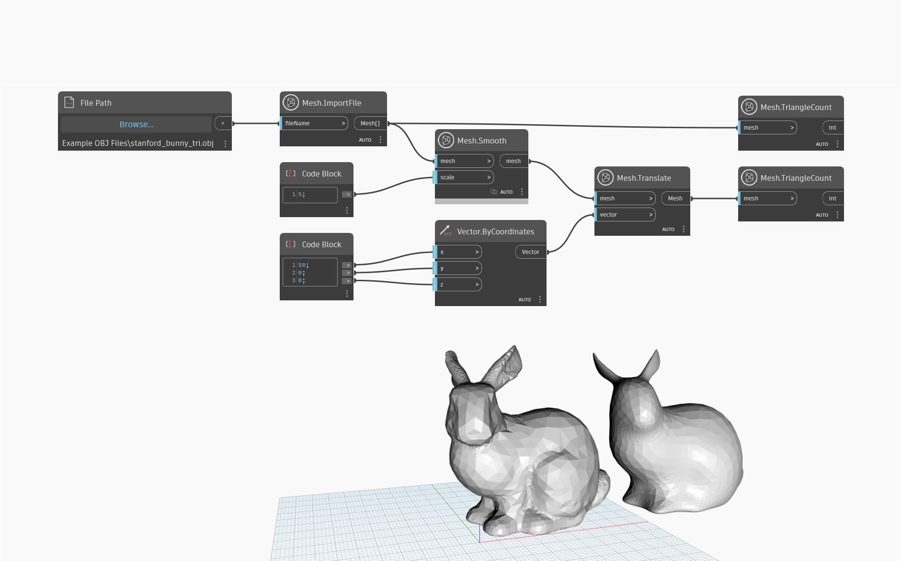

## Podrobnosti
Tento uzel vrací novou vyhlazenou síť pomocí algoritmu vyhlazování dle kontangentoidy, který neroztahuje vrcholy z jejich původní polohy a lépe zachovává prvky a hrany. Chcete-li nastavit prostorové měřítko vyhlazení, je nutné do uzlu zadat hodnotu měřítka. Hodnoty měřítka mohou být vrozsahu od 0,1 do 64,0. Vyšší hodnoty způsobí znatelnější efekt vyhlazení, takže vznikne síť, která se zdá být jednodušší. Přestože nová síť vypadá vyhlazenější a jednodušší, má stejný počet trojúhelníků, hran a vrcholů jako ta původní.

V následujícím příkladu se k importu objektu použije uzel `Mesh.ImportFile`. Poté se k vyhlazení objektu použije uzel `Mesh.Smooth` s měřítkem vyhlazení 5. Objekt se poté přesune na jinou pozici pomocí uzlu `Mesh.Translate` pro lepší náhled a pomocí objektu `Mesh.TriangleCount` se bude sledovat počet trojúhelníků ve staré a nové síti.

## Vzorový soubor

