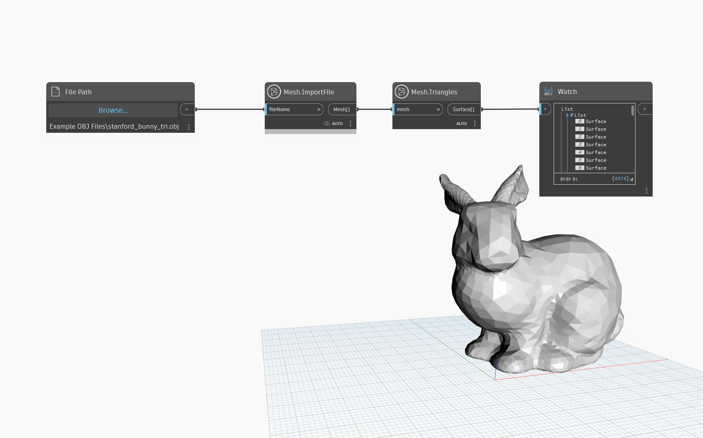

## Podrobnosti
Metoda `Mesh.Triangles` vrací plochy sítě jako seznam povrchů. Všechny povrchy jsou trojúhelníky. Tento uzel lze použít k novému vytvoření sítě, vizualizaci její struktury nebo převodu sítě na jiné třídy geometrií.

## Vzorový soubor

