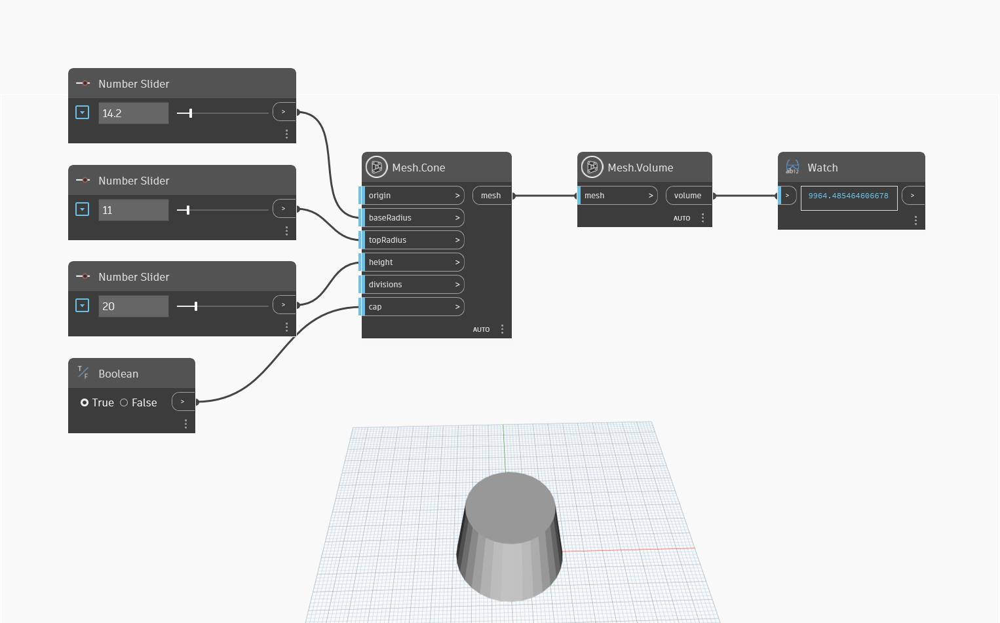

## Podrobnosti
Uzel `Mesh.Volume` vrací objem pevné neprotínající se sítě. V následujícím příkladu se pomocí uzlů `Mesh.Cone` a `Number.Slider` vytvoří kužel, který se poté použije jako vstup k počítání trojúhelníků. Uzel `Mesh.Volume` může být také užitečný k určení toho, zda je povrch sítě uzavřený. Pokud má síť otevřený povrch, uzel vykáže hodnotu `null`.

## Vzorový soubor

