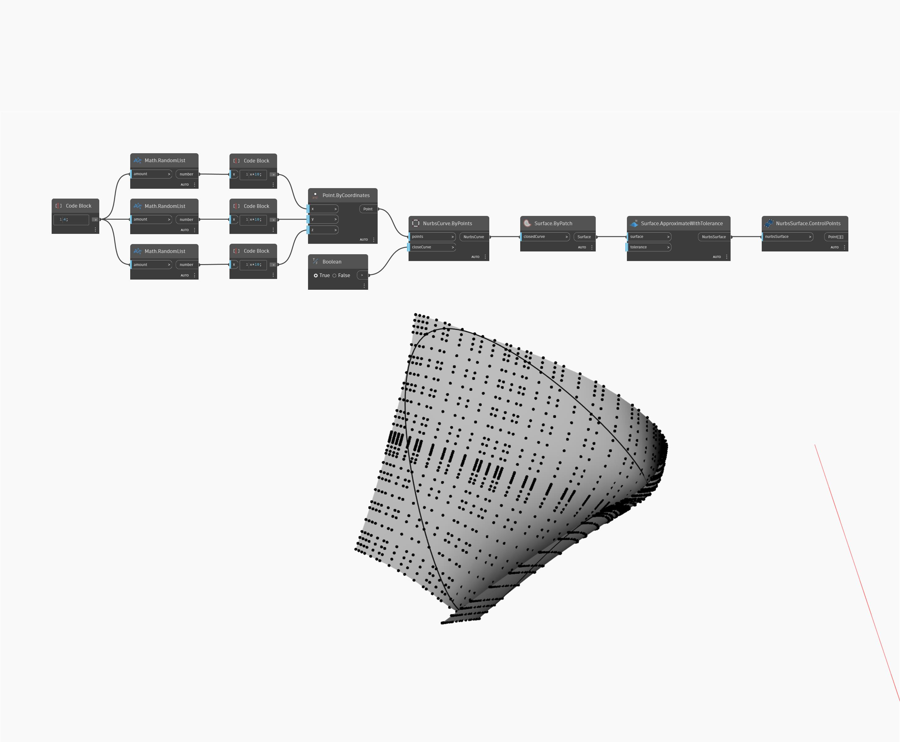

## Podrobnosti
Uzel ControlPoints vrátí objekty ControlPoint objektu NurbsSurface jako body v seznamu seznamů. V níže uvedeném příkladu jsou objekty ControlPoint vráceny z objektu NurbsSurface vytvořeného ze záplaty.
___
## Vzorový soubor

