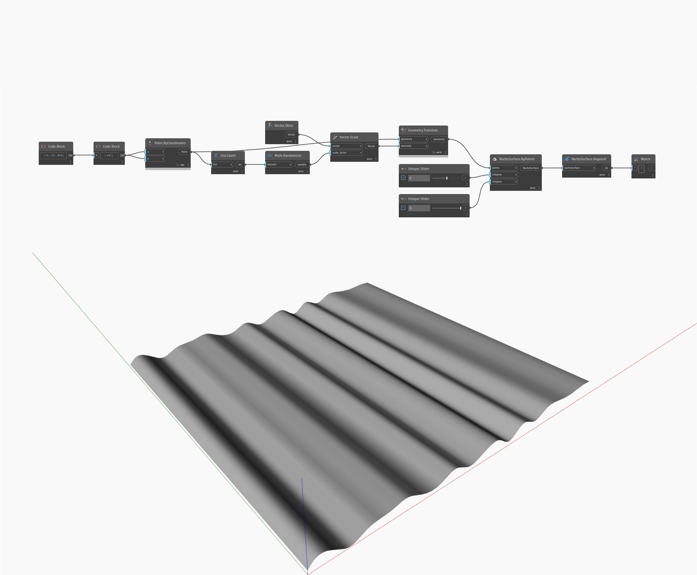

## Podrobnosti
Uzel DegreeV vrátí stupeň objektu NurbsSurface ve směru V. V níže uvedeném příkladu má objekt NurbsSurface vytvořený pomocí bodů a určených stupňů U/V stupeň 2 ve směru V. Při úpravě číselných posuvníků se změní hodnoty stupňů U a V.
___
## Vzorový soubor

