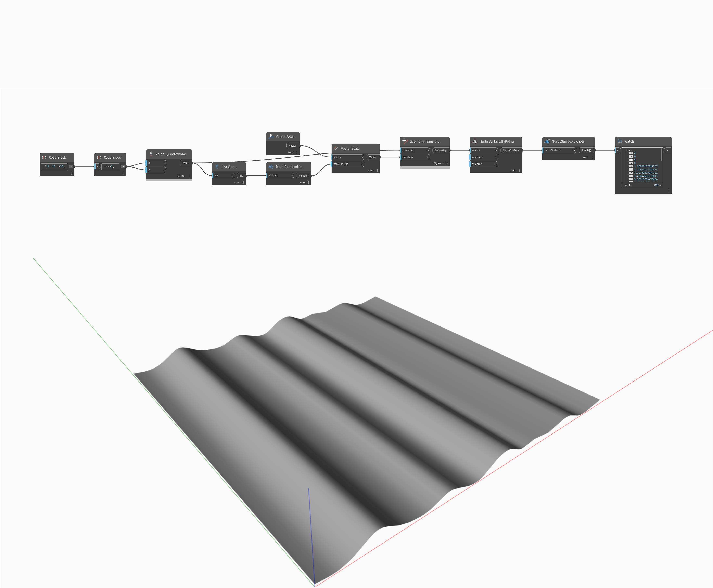

## Podrobnosti
Uzel UKnots vrátí uzly povrchu ve směru U objektu NurbsSurface. V níže uvedeném příkladu jsou vráceny objekty UKnots objektu NurbsSurface jako seznam hodnot typu double.
___
## Vzorový soubor

