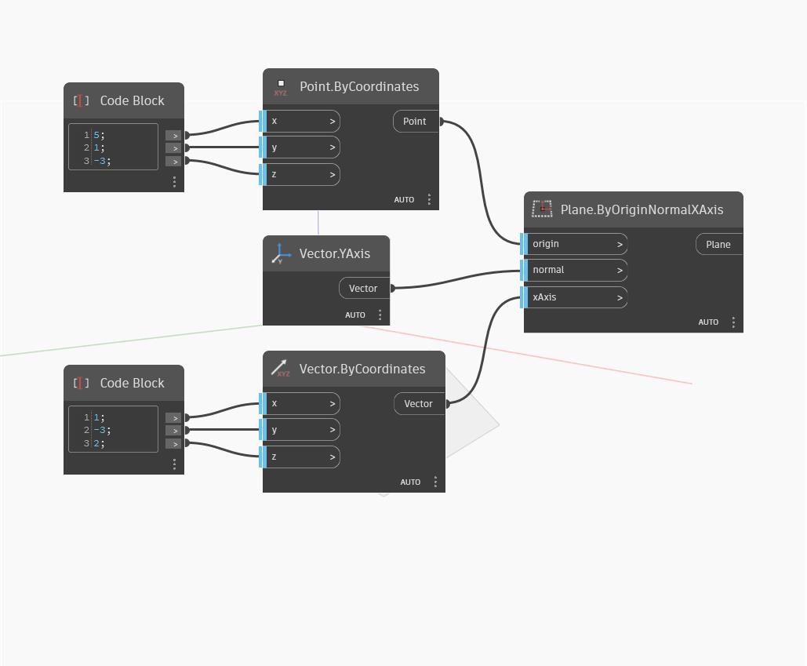

## Podrobnosti
Uzel Plane by Origin Normal XAxis je podobný uzlu Plane By Origin Normal, tento však umožňuje také zadání směru objektu XAxis k řízení orientace roviny. Pokud vstupní vektor xAxis není v rovině definované vstupy počátku a normály, je nejprve promítnut na rovinu k určení roviny objektu XAxis. V níže uvedeném příkladu použijeme jako normálový vektor globální objekt YAxis a pomocí dvou bloků kódu definujeme bod počátku a vstupní objekt xAxis.
___
## Vzorový soubor

