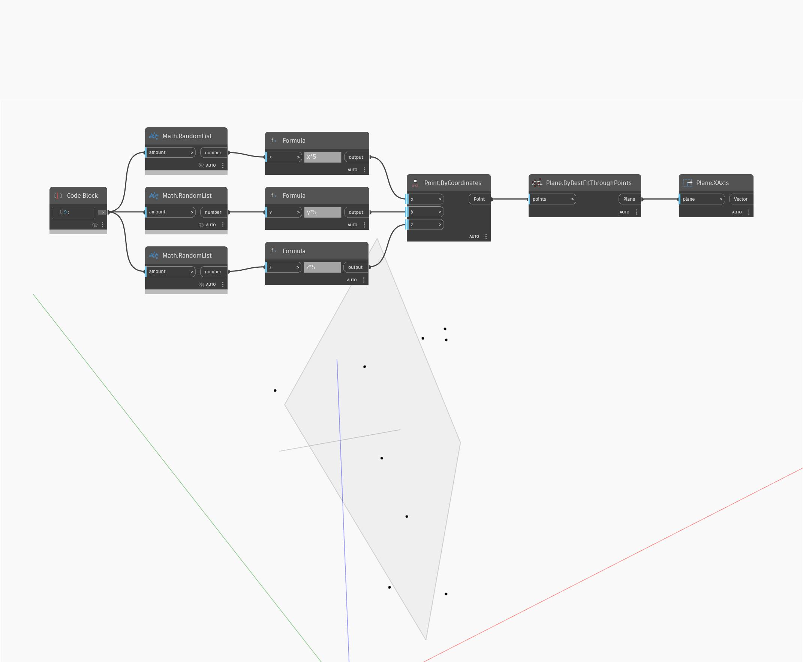

## Podrobnosti
Uzel XAxis vrátí vektor, který představuje osu X objektu WorldCoordinateSystem. V níže uvedeném příkladu se pomocí vráceného vektoru vytvoří úsečka, která následuje osu X v GSS.
___
## Vzorový soubor

