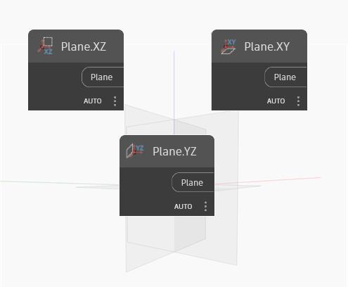

## Podrobnosti
Uzel Plane XY vytvoří rovinu v globálních směrech XY. Normála této roviny je globální osa Z. V ukázkovém souboru zobrazíme rovinu XY, rovinu YZ a rovinu XZ. Na obrázku je zvýrazněna rovina XY.
___
## Vzorový soubor

