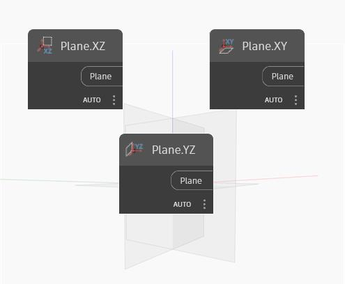

## Podrobnosti
Uzel Plane YZ vytvoří rovinu v globálních směrech YZ. Normála této roviny je globální osa X. V ukázkovém souboru zobrazíme rovinu XY, rovinu YZ a rovinu XZ. Na obrázku je zvýrazněna rovina YZ.
___
## Vzorový soubor

