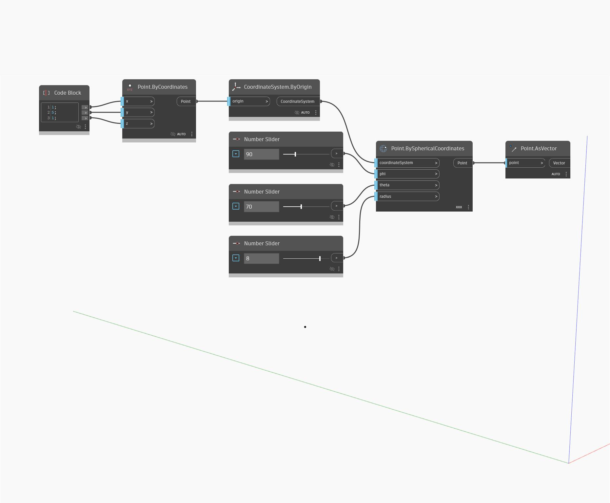

## Podrobnosti
Uzel Point as Vecto přijímá vstupní bod a vrací vektor s komponentami x, y a z rovnými kartézským souřadnicím bodu. Tuto činnost je také možné považovat za tvorbu vektoru pomocí dvou bodů, kde první bod je globální počátek a druhý bod je vstupní bod. V níže uvedeném příkladu vygenerujeme bod pomocí uzlu PointBySphericalCoordinates a poté pomocí uzlu AsVector získáme vektor, který je možné řídit pomocí kulových souřadnic.
___
## Vzorový soubor

