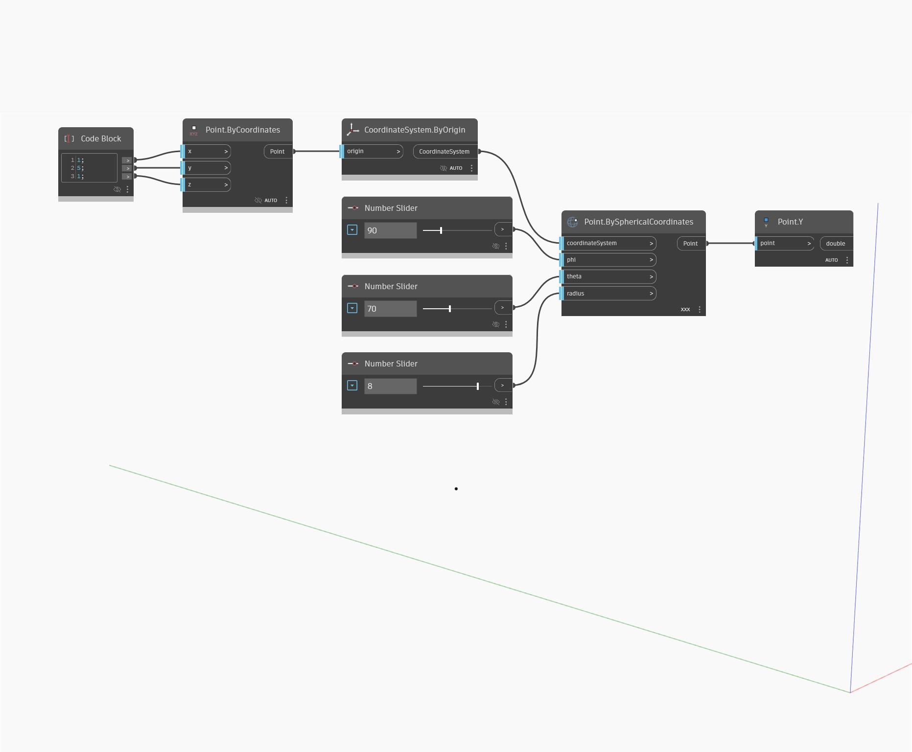

## Podrobnosti
Uzel `Point.Y` vrací hodnotu y globálního prostoru vstupního bodu.

V následujícím příkladu vytvoříme pomocí uzlu `Point.BySphericalCoordinates` bod a poté pomocí uzlu `Point.Y` vrátíme jeho souřadnici y.

___
## Vzorový soubor

