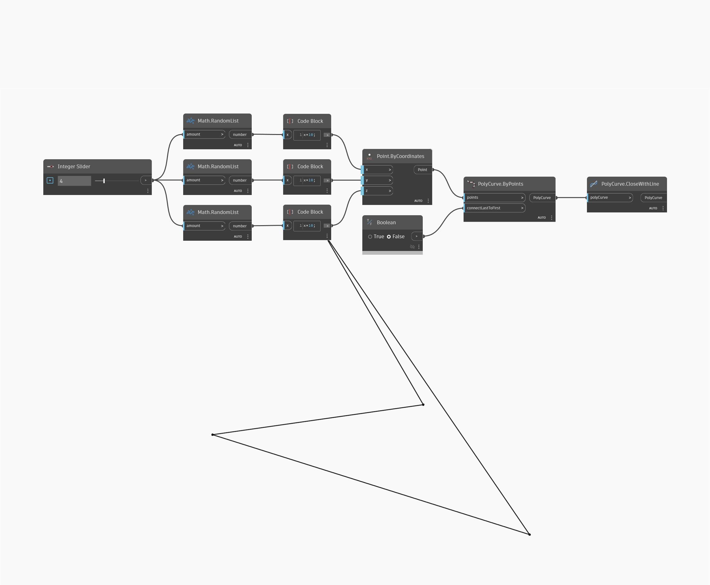

## Podrobnosti
Uzel Close With Line přidá přímou úsečku mezi počátečním a koncovým bodem otevřeného objektu PolyCurve. Vrací nový objekt PolyCurve, který obsahuje přidanou úsečku. V následujícím příkladu vygenerujeme sadu náhodných bodů a pomocí uzlu PolyCuve By Points se vstupem connectLastToFirst nastaveným na hodnotu false vytvoříme otevřený objekt PolyCurve. Zadáním tohoto objektu PolyCurve do vstupu uzlu Close With Line vytvoříte nový uzavřený objekt PolyCurve (v tomto případě se jedná o ekvivalentní případ k použití hodnoty 'true' u možnosti connectLastToFirst v uzlu PolyCurve By Points).
___
## Vzorový soubor

