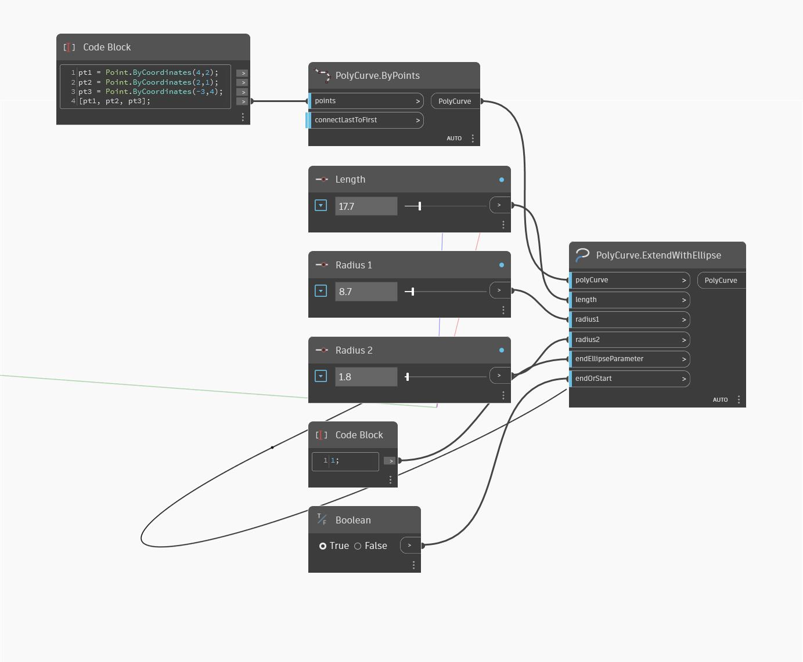

## Podrobnosti
Uzel ExtendWithEllipse vrátí prodloužení objektu PolyCurve jako části elipsy. V níže uvedeném příkladu je objekt PolyCurve s jediným segmentem prodloužen do elipsy. Prodloužení je řízeno dvěma poloměry, délkou, koncovým parametrem a údajem, zda bude prodloužen počátek nebo konec objektu PolyCurve.
___
## Vzorový soubor

