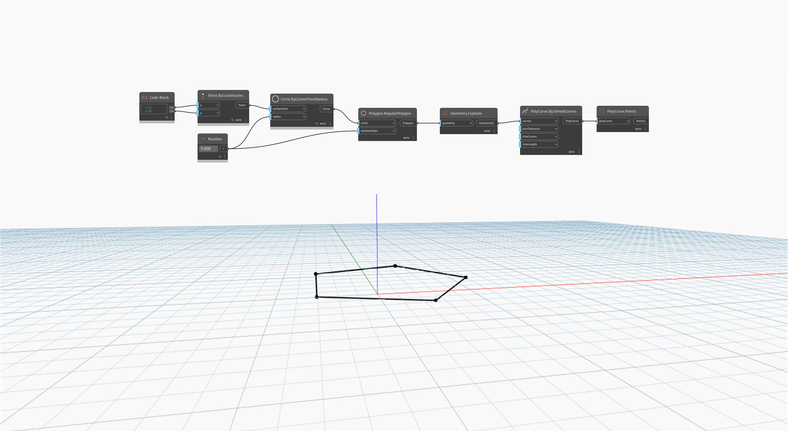

## Podrobnosti
Uzel `PolyCurve.Points` vrací počáteční bod první křivky komponenty a koncové body všech ostatních křivek komponent. U uzavřených objektů PolyCurve nevrací duplicitní body.

V následujícím příkladu je objekt `Polygon.RegularPolygon` rozložen na seznam křivek a znovu spojen na objekt PolyCurve. Poté jsou pomocí uzlu `PolyCurve.Points` vráceny body objektu PolyCurve.
___
## Vzorový soubor

