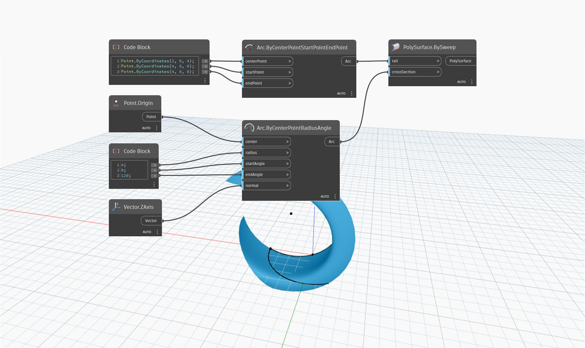

## Podrobnosti
Uzel `PolySurface.BySweep (rail, crossSection)` vrací objekt PolySurface tažením seznamu spojených neprotínajících se úseček podél trajektorie. Vstup `crossSection` může obdržet seznam spojených křivek, které se musí dotýkat v počátečním nebo koncovém bodě, jinak uzel nevrátí objekt PolySurface. Tento uzel je podobný uzlu `PolySurface.BySweep (rail, profile)`, přičemž jediným rozdílem je, že vstup `crossSection` přijímá seznam křivek, zatímco vstup `profile` přijímá pouze jednu křivku.

V následujícím příkladu je objekt PolySurface vytvořen tažením podél oblouku.

___
## Vzorový soubor

