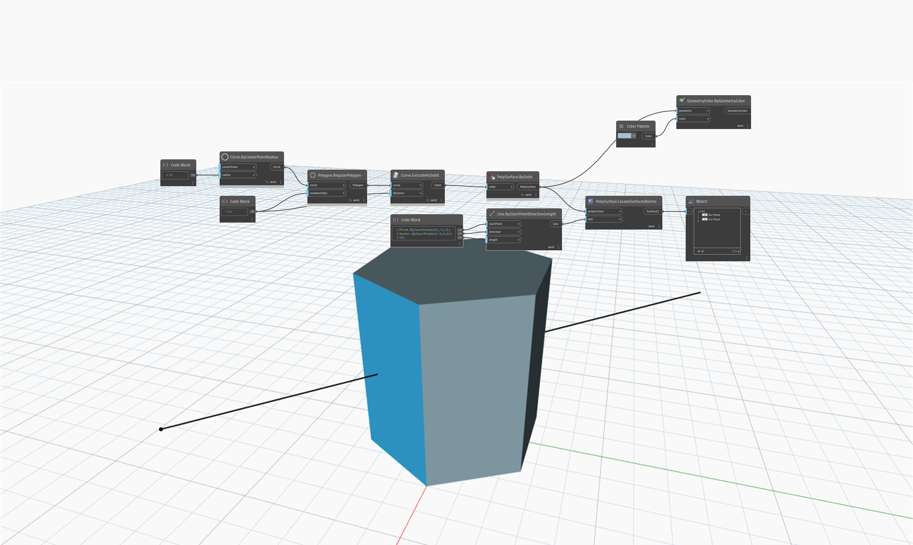

## Podrobnosti
Uzel `PolySurface.LocateSurfacesByLine` vrací všechny povrchy, které protíná úsečka.

V následujícím příkladu je nalezena úsečka na dvou místech procházející vysunutým šestiúhelníkem a uzel vrací dva povrchy.

___
## Vzorový soubor

