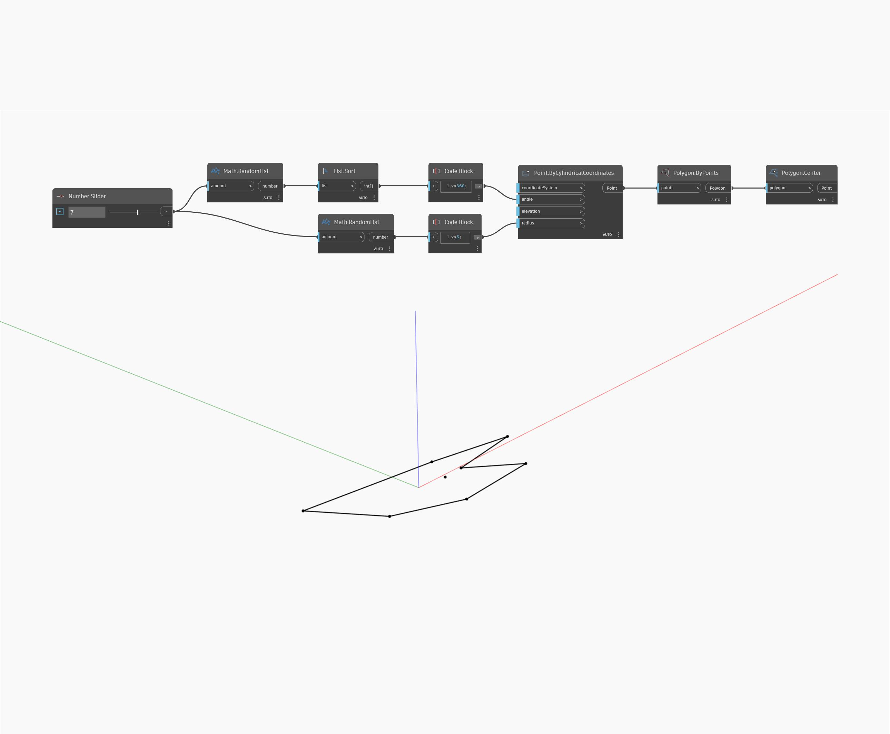

## Podrobnosti
Uzel Polygon Center najde střed daného polygonu pomocí průměrné hodnoty rohů. U konkávních polygonů je možné, že bude střed ve skutečnosti ležet mimo polygon. V níže uvedeném příkladu nejprve vygenerujeme seznam náhodných úhlů a poloměrů, které se použijí jako vstupy pro uzel Point By Cylindrical Coordinates. Pokud nejprve seřadíme úhly, zajistíme, že výsledný polygon bude propojen v pořadí zvětšujících se úhlů, a tudíž nebude protínat sebe sama. Poté je možné pomocí uzlu Center získat průměr z bodů a najít střed polygonu.
___
## Vzorový soubor

