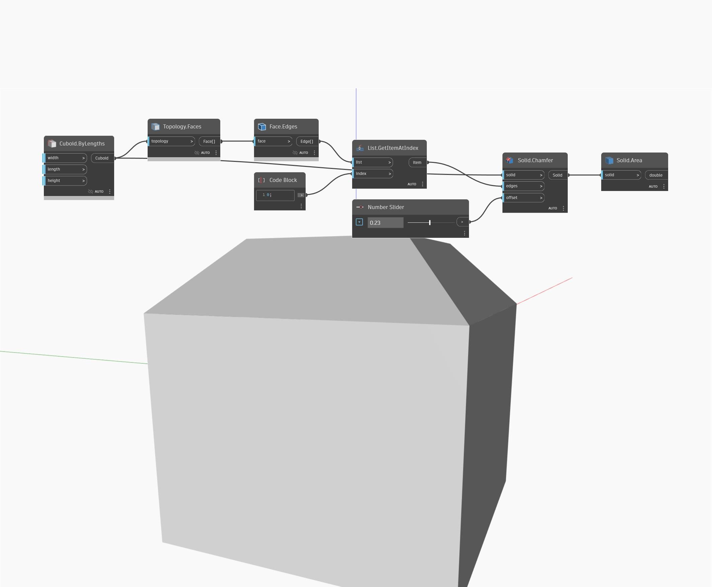

## Podrobnosti
Uzel `Solid.Area` vrací plochu povrchu daného tělesa.

V následujícím příkladu začneme krychlí a poté zkosením hran vytvoříme nové těleso. Pomocí uzlu `Solid.Area` najdeme celkovou plochu všech povrchů tohoto tělesa.

___
## Vzorový soubor

