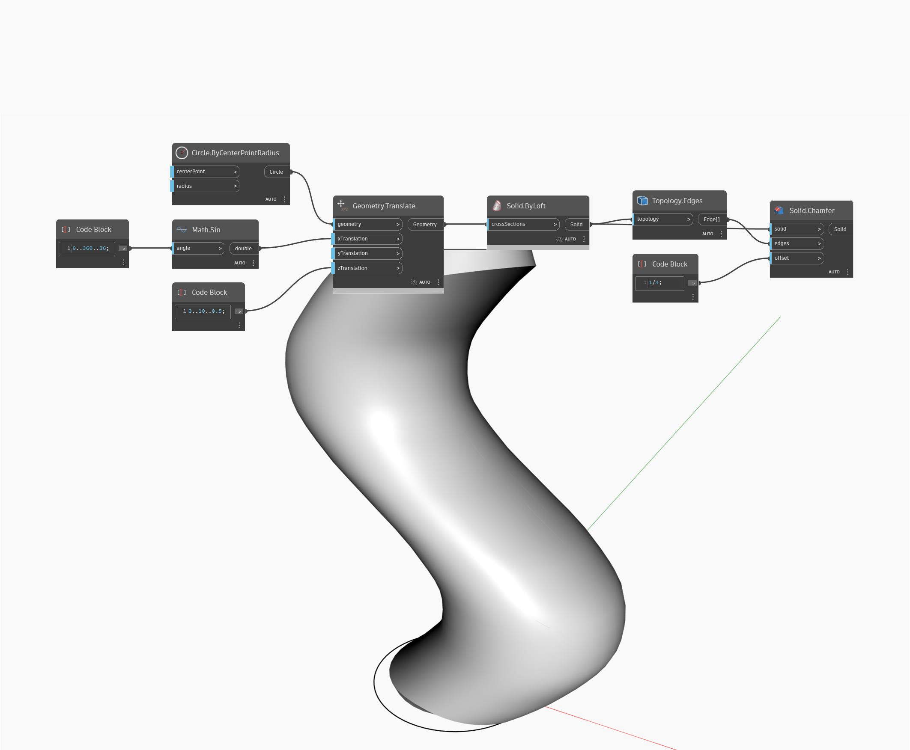

## Podrobnosti
Uzel Chamfer vrátí nové těleso se zkosenými hranami. Vstup edges určuje, které hrany se zkosí, zatímco vstup offset určuje rozsah zkosení. V níže uvedeném příkladu začneme tvorbou krychle pomocí výchozích vstupů. Abychom získali vhodné hrany krychle, nejprve rozložíme krychli, čímž získáme plochy jako seznam povrchů. Poté pomocí uzlu Face.Edges extrahujeme hrany krychle. Pomocí uzlu GetItemAtIndex extrahujeme první hranu každé plochy. Pomocí číselného posuvníku je možné určit vzdálenost odsazení zkosení.
___
## Vzorový soubor

