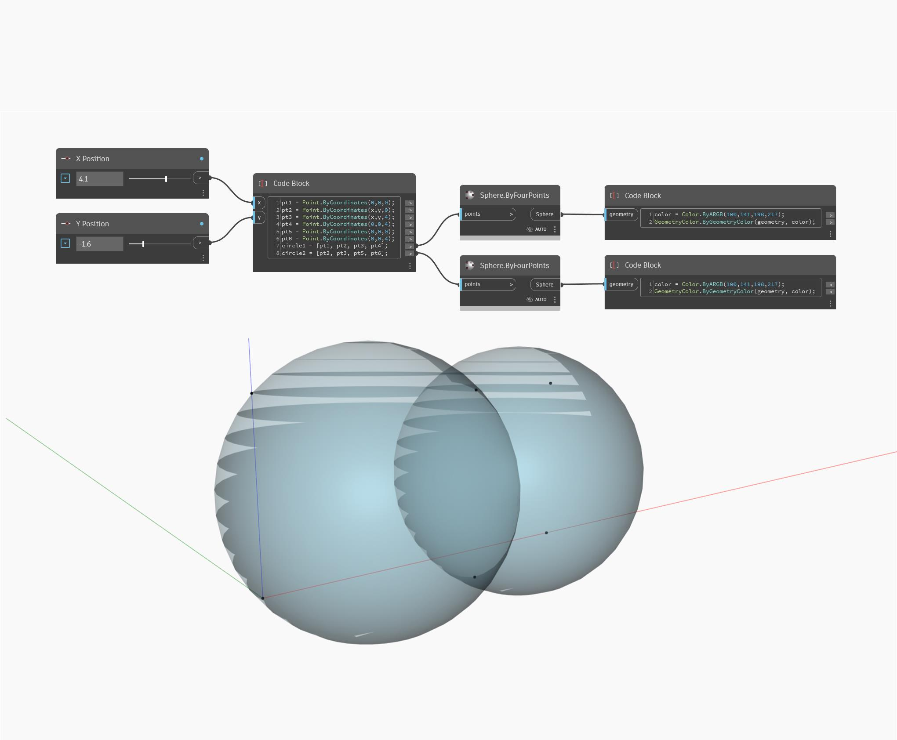

## Podrobnosti
Uzel ByFourPoints vrátí kouli ze čtyř vstupních bodů na povrchu. V níže uvedeném příkladu jsou vytvořeny dvě koule z kolekce šesti bodů. Při úpravě posuvníků Pozice X a Pozice Y dojde ke změně velikosti každé koule vzhledem k té druhé. Je důležité zdůraznit, že ne každá kolekce čtyř bodů bude tvořit kouli. Je nutné, aby všechny body mohly být na povrchu koule.
___
## Vzorový soubor

