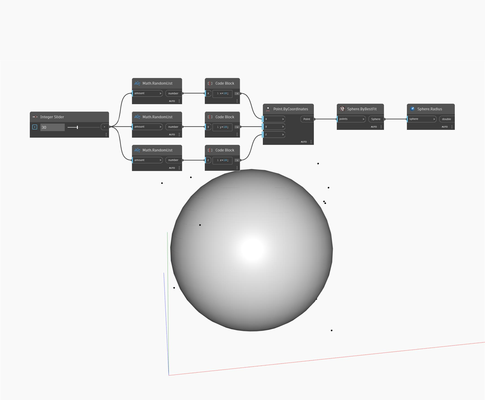

## Podrobnosti
Uzel Radius vrátí střed vstupní koule. V níže uvedeném příkladu vytvoříme pomocí uzlu ByBestFit kouli podle sady náhodných bodů. Poté pomocí uzlu Radius určíme velikost nejvhodnější koule.
___
## Vzorový soubor

