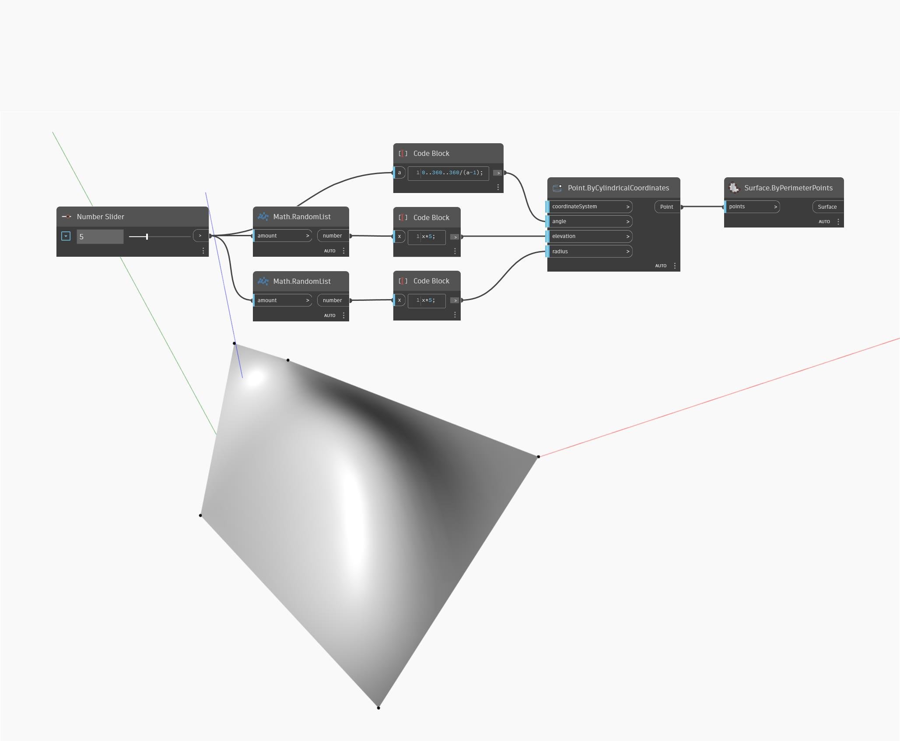

## Podrobnosti
Uzel Surface by Perimeter Points přijímá na vstupu seznam bodů, který definuje obvod uzavřeného polygonu, a vytvoří povrch uvnitř výsledného polygonu. V níže uvedeném příkladu vytvoříme řadu bodů pomocí válcových souřadnic. Body se vytvářejí v pravidelných intervalech kolem válce s náhodnými vstupy poloměru a výšky. Výsledný seznam bodů se použije jako vstup pro uzel Surface ByPerimeterPoints.
___
## Vzorový soubor

