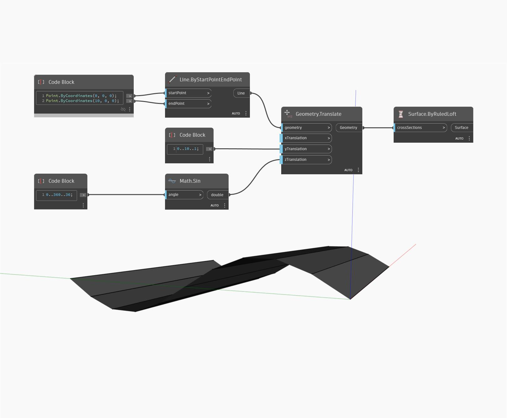

## Podrobnosti
Uzel Surface by Ruled Loft přijímá jako vstup uspořádaný seznam křivek a šablonuje mezi křivkami přímkovou plochu s přímými úsečkami. Ve srovnání s uzlem ByLoft může být uzel ByRuledLoft o něco rychlejší, výsledný povrch je však méně hladký. V níže uvedeném příkladu začínáme úsečkou podél osy X. Tuto úsečku přesuneme do řady úseček, které sledují sinusoidu ve směru osy Y. Pokud použijete výsledný seznam úseček jako vstup pro uzel Surface ByRuledLoft, vznikne povrch s přímými úsečkovými segmenty mezi vstupními křivkami.
___
## Vzorový soubor

