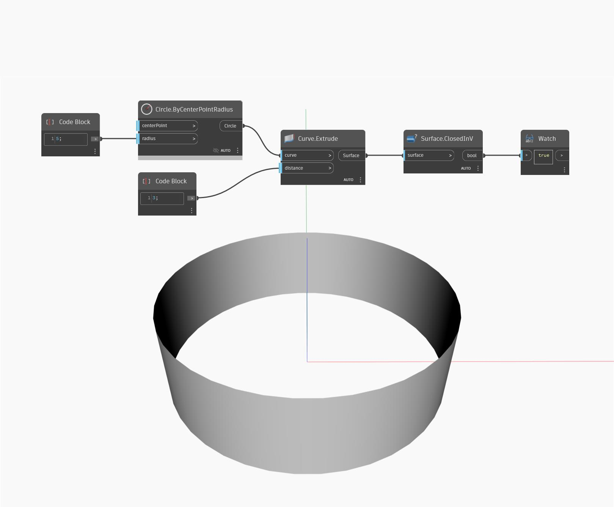

## Podrobnosti
Uzel ClosedInV vrátí booleovskou hodnotu podle toho, zda je povrch uzavřený v jeho směru V. V níže uvedeném příkladu vrací vysunutá uzavřená kružnice v jednom směru hodnotu true, protože je uzavřená ve směru V.
___
## Vzorový soubor

