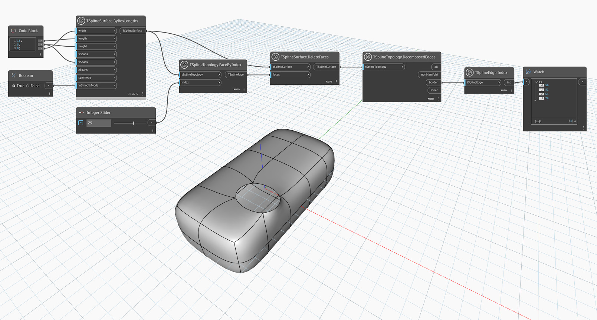

## In-Depth
V topologii povrchu T-Spline nemusí indexy `Face`, `Edge` a `Vertex` nutně odpovídat pořadovým číslům položek v seznamu. Vyřešte tento problém pomocí uzlu `TSplineSurface.CompressIndices`.

V níže uvedeném příkladu se načtou okrajové hrany povrchu T-Spline pomocí uzlu `TSplineTopology.DecomposedEdges` a získají se indexy zadaných hran pomocí uzlu `TSplineEdge.Index`.

## Vzorový soubor

