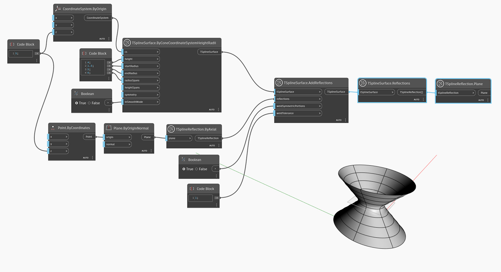

## In-Depth
Uzel `TSplineInitialReflection.Plane` zobrazí rovinu, kolem které je odraz původně proveden.

V níže uvedeném příkladu je pomocí uzlu `TSplineSurface.Reflections` zadán dotaz na odrazy použité na vstup povrchu T-Spline. Poté je pomocí uzlu `TSplineReflection.Plane` vrácena rovina, která se použila k provedení odrazu.

## Vzorový soubor

